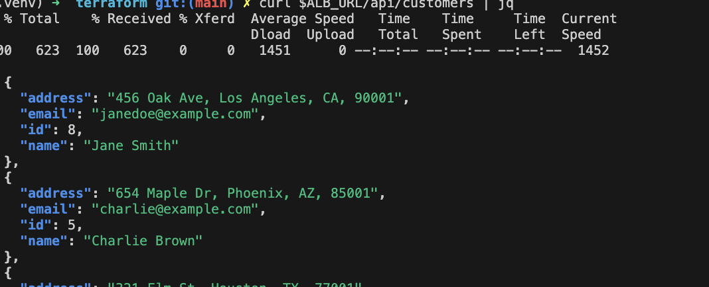
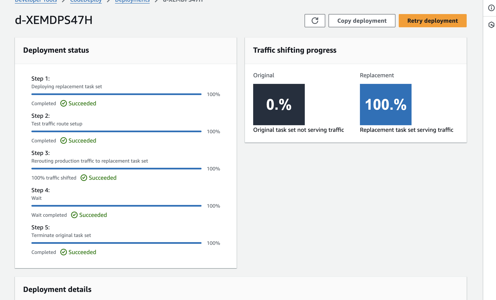
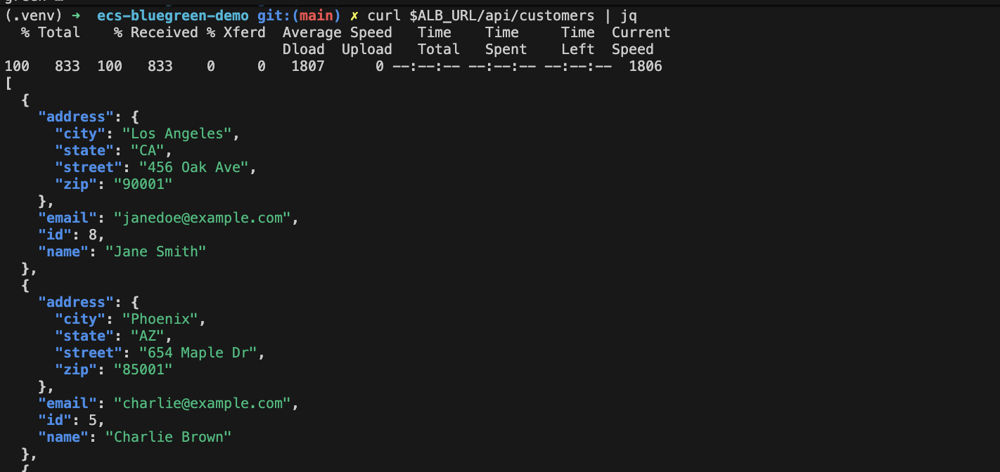
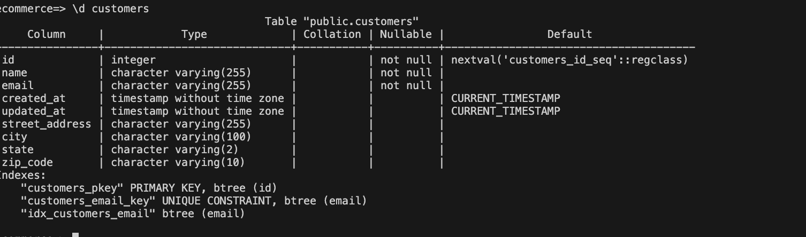

# AWS Deployment Guide - Blue-Green ECS with Database Migrations

Complete step-by-step guide to deploy the blue-green ECS infrastructure on AWS.

---

## Prerequisites

1. **AWS Account** with appropriate permissions
2. **AWS CLI** installed and configured
3. **Terraform** >= 1.0 installed
4. **Docker** installed locally
5. **PostgreSQL client** (psql) for migrations

```bash
# Verify installations
aws --version
terraform --version
docker --version
psql --version
```

---

## Step 1: Configure AWS Credentials

```bash
# Configure AWS CLI
aws configure

# Enter your credentials:
# AWS Access Key ID: YOUR_ACCESS_KEY
# AWS Secret Access Key: YOUR_SECRET_KEY
# Default region: us-east-1
# Default output format: json

# Verify configuration
aws sts get-caller-identity
```

---

## Step 2: Prepare Terraform Variables

Create `terraform/terraform.tfvars`:

```hcl
# terraform/terraform.tfvars
aws_region         = "us-east-1"
project_name       = "ecommerce-bluegreen"
environment        = "production"
vpc_cidr           = "10.0.0.0/16"

# Database credentials (CHANGE THESE!)
db_username = "dbadmin"
db_password = "ChangeThisPassword123!"

# Container configuration
# This will be updated after we push the image to ECR
container_image = "PLACEHOLDER"
container_port  = 8080

# Scaling configuration
desired_count = 2
cpu           = "256"
memory        = "512"

# Notifications
notification_email = "your-email@example.com"
```

⚠️ **Security Note:** Never commit `terraform.tfvars` to git! Add it to `.gitignore`.

---

## Step 3: Initialize Terraform

```bash
cd terraform

# Initialize Terraform
terraform init

# Validate configuration
terraform validate

# Preview what will be created
terraform plan
```

---

## Step 4: Deploy Initial Infrastructure (Without App)

We'll deploy the infrastructure first, then build and push the Docker image.

```bash
# Apply Terraform (will fail at ECS service due to missing image)
# But that's OK - we'll update it after building the image
terraform apply -target=aws_ecr_repository.app

# Get ECR repository URL
export ECR_REPO=$(terraform output -raw ecr_repository_url)
echo "ECR Repository: $ECR_REPO"
```

---

## Step 5: Build and Push Docker Image

```bash
cd ..  # Back to project root

# Set variables
export AWS_REGION=us-east-1
export AWS_ACCOUNT_ID=$(aws sts get-caller-identity --query Account --output text)
export ECR_REPOSITORY=ecommerce-bluegreen
export IMAGE_TAG=v1.0.0

# Login to ECR
aws ecr get-login-password --region $AWS_REGION | \
    docker login --username AWS --password-stdin $AWS_ACCOUNT_ID.dkr.ecr.$AWS_REGION.amazonaws.com

# Build the image
docker build --platform linux/amd64 -t $ECR_REPOSITORY:$IMAGE_TAG -f docker/Dockerfile .

# Tag for ECR
docker tag $ECR_REPOSITORY:$IMAGE_TAG \
    $AWS_ACCOUNT_ID.dkr.ecr.$AWS_REGION.amazonaws.com/$ECR_REPOSITORY:$IMAGE_TAG

# Push to ECR
docker push $AWS_ACCOUNT_ID.dkr.ecr.$AWS_REGION.amazonaws.com/$ECR_REPOSITORY:$IMAGE_TAG

# Update terraform.tfvars with the image URL
echo "container_image = \"$AWS_ACCOUNT_ID.dkr.ecr.$AWS_REGION.amazonaws.com/$ECR_REPOSITORY:$IMAGE_TAG\"" >> terraform/terraform.tfvars
```

---

## Step 6: Deploy Complete Infrastructure

```bash
cd terraform

# Now deploy everything
terraform apply

# Type 'yes' when prompted
# This will take ~15-20 minutes
```

**What gets created:**
- VPC with public/private subnets across 2 AZs
- Internet Gateway and NAT Gateways
- Application Load Balancer (2 listeners: production on port 80, test on port 8080)
- ECS Cluster with Fargate
- RDS PostgreSQL database
- ECR repository
- CodeDeploy application and deployment group
- CloudWatch alarms and dashboard
- IAM roles and security groups
- Secrets Manager for database credentials

---

## Step 7: Get Infrastructure Details

```bash
# Get all outputs
terraform output

# Important outputs:
export ALB_URL=$(terraform output -raw alb_url)
export TEST_URL=$(terraform output -raw test_url)
export DB_ENDPOINT=$(terraform output -raw db_endpoint)
export ECR_URL=$(terraform output -raw ecr_repository_url)

echo "Application URL: $ALB_URL"
echo "Test URL: $TEST_URL"
echo "Database Endpoint: $DB_ENDPOINT"
```

---

## Step 8: Initialize Database Schema

Connect to the database through a bastion or by temporarily allowing your IP:

### Option A: Using EC2 Bastion (Recommended for Production)
This is what we are using in this guide


```bash
# Copy the migration files to the bastion host from your local machine

scp -i ~/.ssh/id_rsa docker/init.sql ec2-user@$BASTION_IP:/tmp/
scp -i ~/.ssh/id_rsa migrations/*.sql ec2-user@$BASTION_IP:/tmp/

# Then SSH into it and run migrations
ssh -i your-key.pem ec2-user@$BASTION_IP

# Inside the bastion:
psql -h $DB_ENDPOINT -U dbadmin -d ecommerce -f /tmp/init.sql
```

### Option B: Direct Connection (For Testing - Not Production!)

```bash
# Temporarily modify RDS security group to allow your IP
export YOUR_IP=$(curl -s https://api.ipify.org)

# Add inbound rule to RDS security group
aws ec2 authorize-security-group-ingress \
    --group-id $(terraform output -raw rds_security_group_id) \
    --protocol tcp \
    --port 5432 \
    --cidr $YOUR_IP/32

# Run initial schema
psql -h $DB_ENDPOINT -U dbadmin -d ecommerce -f docker/init.sql

# IMPORTANT: Remove the rule after!
aws ec2 revoke-security-group-ingress \
    --group-id $(terraform output -raw rds_security_group_id) \
    --protocol tcp \
    --port 5432 \
    --cidr $YOUR_IP/32
```

### Option C: Using ECS Exec (Most Secure)

```bash
# Enable ECS Exec on the service
aws ecs update-service \
    --cluster ecommerce-bluegreen-cluster \
    --service ecommerce-bluegreen-service \
    --enable-execute-command \
    --force-new-deployment

# Get a task ARN
TASK_ARN=$(aws ecs list-tasks \
    --cluster ecommerce-bluegreen-cluster \
    --service ecommerce-bluegreen-service \
    --query 'taskArns[0]' --output text)

# Execute into the container
aws ecs execute-command \
    --cluster ecommerce-bluegreen-cluster \
    --task $TASK_ARN \
    --container app \
    --interactive \
    --command "/bin/bash"

# Inside the container, run migrations
psql -h $DB_ENDPOINT -U dbadmin -d ecommerce -f /tmp/init.sql
```

---

## Step 9: Verify Blue Environment

```bash
# Wait for tasks to be healthy (check every 30 seconds)
watch -n 30 "aws ecs describe-services \
    --cluster ecommerce-bluegreen-cluster \
    --services ecommerce-bluegreen-service \
    --query 'services[0].{Desired:desiredCount,Running:runningCount,Pending:pendingCount}'"

# Once running, test the application
curl $ALB_URL/health | jq

# Expected response:
# {
#   "status": "healthy",
#   "version": "blue",
#   "environment": "production",
#   "database": "connected",
#   "schema": "compatible"
# }

# Test creating a customer
curl -X POST $ALB_URL/api/customers \
    -H "Content-Type: application/json" \
    -d '{
      "name": "John Doe",
      "email": "john@example.com",
      "address": "123 Main St, New York, NY, 10001"
    }' | jq

# List customers
curl $ALB_URL/api/customers | jq
```

---

## Step 10: Prepare for Blue-Green Deployment

### 10.1: Run Expand Migration

```bash
# Run the expand migration (adds new columns)
psql -h $DB_ENDPOINT -U dbadmin -d ecommerce -f migrations/001_expand_address.sql

# Verify new columns exist
psql -h $DB_ENDPOINT -U dbadmin -d ecommerce -c "\d customers"

# Should show: street_address, city, state, zip_code columns
```

### 10.2: Build Green Version

Update the code to use APP_VERSION=green environment variable:

```bash
# Build new version
export IMAGE_TAG=v2.0.0

docker build --platform linux/amd64 -t $ECR_REPOSITORY:$IMAGE_TAG -f docker/Dockerfile .

docker tag $ECR_REPOSITORY:$IMAGE_TAG \
    $AWS_ACCOUNT_ID.dkr.ecr.$AWS_REGION.amazonaws.com/$ECR_REPOSITORY:$IMAGE_TAG

docker push $AWS_ACCOUNT_ID.dkr.ecr.$AWS_REGION.amazonaws.com/$ECR_REPOSITORY:$IMAGE_TAG
```

### 10.3: Create New Task Definition

```bash
# Register new task definition with APP_VERSION=green
cat > task-def-green.json <<EOF
{
  "family": "ecommerce-bluegreen",
  "networkMode": "awsvpc",
  "requiresCompatibilities": ["FARGATE"],
  "cpu": "256",
  "memory": "512",
  "executionRoleArn": "$(terraform output -raw ecs_task_execution_role_arn)",
  "taskRoleArn": "$(terraform output -raw ecs_task_role_arn)",
  "containerDefinitions": [{
    "name": "app",
    "image": "$AWS_ACCOUNT_ID.dkr.ecr.$AWS_REGION.amazonaws.com/$ECR_REPOSITORY:$IMAGE_TAG",
    "essential": true,
    "portMappings": [{
      "containerPort": 8080,
      "protocol": "tcp"
    }],
    "environment": [
      {"name": "APP_VERSION", "value": "green"},
      {"name": "ENVIRONMENT", "value": "production"},
      {"name": "AWS_REGION", "value": "$AWS_REGION"},
      {"name": "DB_HOST", "value": "$DB_ENDPOINT"},
      {"name": "DB_PORT", "value": "5432"},
      {"name": "DB_NAME", "value": "ecommerce"}
    ],
    "secrets": [
      {
        "name": "DB_USER",
        "valueFrom": "$(terraform output -raw db_secret_arn):username::"
      },
      {
        "name": "DB_PASSWORD",
        "valueFrom": "$(terraform output -raw db_secret_arn):password::"
      }
    ],
    "logConfiguration": {
      "logDriver": "awslogs",
      "options": {
        "awslogs-group": "/ecs/ecommerce-bluegreen",
        "awslogs-region": "$AWS_REGION",
        "awslogs-stream-prefix": "ecs"
      }
    },
    "healthCheck": {
      "command": ["CMD-SHELL", "curl -f http://localhost:8080/health || exit 1"],
      "interval": 30,
      "timeout": 5,
      "retries": 3,
      "startPeriod": 60
    }
  }]
}
EOF

# Register the task definition
aws ecs register-task-definition --cli-input-json file://task-def-green.json
```

---

## Step 11: Create AppSpec for CodeDeploy

```bash
# Get the actual task definition ARN (don't use "LATEST")
TASK_DEF_ARN=$(aws ecs describe-task-definition \
  --task-definition ecommerce-bluegreen \
  --query 'taskDefinition.taskDefinitionArn' \
  --output text)

echo "Task Definition ARN: $TASK_DEF_ARN"

# Create AppSpec as JSON (CodeDeploy requires JSON format)
cat > appspec.json << EOF
{
  "version": 0.0,
  "Resources": [
    {
      "TargetService": {
        "Type": "AWS::ECS::Service",
        "Properties": {
          "TaskDefinition": "${TASK_DEF_ARN}",
          "LoadBalancerInfo": {
            "ContainerName": "app",
            "ContainerPort": 8080
          }
        }
      }
    }
  ]
}
EOF

echo "AppSpec created at appspec.json"
```

---

## Step 12: Execute Blue-Green Deployment

```bash

APPSPEC=$(cat appspec.json | jq -c .)

# Create deployment with properly formatted JSON
aws deploy create-deployment \
  --application-name ecommerce-bluegreen \
  --deployment-group-name ecommerce-bluegreen-deployment-group \
  --deployment-config-name CodeDeployDefault.ECSAllAtOnce \
  --description "Initial deployment" \
  --cli-input-json "{
    \"revision\": {
      \"revisionType\": \"AppSpecContent\",
      \"appSpecContent\": {
        \"content\": $(echo "$APPSPEC" | jq -Rs .)
      }
    }
  }"

# Get deployment ID
export DEPLOYMENT_ID=$(aws deploy list-deployments \
    --application-name ecommerce-bluegreen \
    --deployment-group-name ecommerce-bluegreen-deployment-group \
    --query 'deployments[0]' \
    --output text)

echo "Deployment ID: $DEPLOYMENT_ID"

# Monitor deployment status
watch -n 10 "aws deploy get-deployment --deployment-id $DEPLOYMENT_ID \
    --query 'deploymentInfo.status' --output text"
```

### Monitor During Deployment

```bash
# Watch the deployment in real-time
aws deploy get-deployment --deployment-id $DEPLOYMENT_ID --query 'deploymentInfo'

# Check target health for both groups
aws elbv2 describe-target-health \
    --target-group-arn $(terraform output -raw blue_target_group_arn)

aws elbv2 describe-target-health \
    --target-group-arn $(terraform output -raw green_target_group_arn)

# View CloudWatch dashboard
echo "Dashboard: $(terraform output -raw cloudwatch_dashboard_url)"

# Test both versions during deployment
curl $ALB_URL/health | jq .version       # Production traffic
curl $TEST_URL/health | jq .version      # Test traffic
```

---

## Step 13: Verify Green Environment

```bash
# Test the test listener (green environment)
curl $TEST_URL/health | jq

# Expected:
# {
#   "status": "healthy",
#   "version": "green",
#   "environment": "production",
#   "database": "connected",
#   "schema": "compatible"
# }

# Create customer with V2 API (structured address)
curl -X POST $TEST_URL/api/customers \
    -H "Content-Type: application/json" \
    -d '{
      "name": "Jane Smith",
      "email": "jane@example.com",
      "address": {
        "street": "456 Oak Ave",
        "city": "Los Angeles",
        "state": "CA",
        "zip": "90001"
      }
    }' | jq

# Verify backwards compatibility - read with blue
curl $ALB_URL/api/customers | jq
```



---

## Step 14: Monitor Deployment Progress



The deployment configuration (`CodeDeployDefault.ECSLinear10PercentEvery3Minutes`) will:
- Shift 10% of traffic every 3 minutes
- Complete in 30 minutes total
- Auto-rollback if CloudWatch alarms trigger

```bash
# Monitor traffic distribution
while true; do
    echo "=== Traffic Distribution ==="
    echo "Production (Blue->Green shifting):"
    curl -s $ALB_URL/health | jq -r '.version'
    echo "Test (Green):"
    curl -s $TEST_URL/health | jq -r '.version'
    echo ""
    sleep 30
done
```

---

## Step 15: Post-Deployment Validation

After deployment completes and all traffic is on green:

```bash
# All production traffic should now return 'green'
for i in {1..10}; do
    curl -s $ALB_URL/health | jq -r '.version'
done


# Test CRUD operations
# Create
CUSTOMER_ID=$(curl -s -X POST $ALB_URL/api/customers \
    -H "Content-Type: application/json" \
    -d '{
      "name": "Test User",
      "email": "test@example.com",
      "address": {
        "street": "789 Test St",
        "city": "Test City",
        "state": "TX",
        "zip": "75001"
      }
    }' | jq -r '.id')

# Read
curl $ALB_URL/api/customers/$CUSTOMER_ID | jq

# Update
curl -X PUT $ALB_URL/api/customers/$CUSTOMER_ID \
    -H "Content-Type: application/json" \
    -d '{
      "name": "Updated User",
      "email": "updated@example.com",
      "address": {
        "street": "999 Updated Ave",
        "city": "Updated City",
        "state": "CA",
        "zip": "90210"
      }
    }' | jq

# List all
curl $ALB_URL/api/customers | jq
```



---

## Step 16: Contract Phase (After Stability Period)

⚠️ **CRITICAL:** Only do this after green has been stable for 24-72 hours!

```bash
# Backup database first!
aws rds create-db-snapshot \
    --db-instance-identifier ecommerce-bluegreen-db \
    --db-snapshot-identifier pre-contract-$(date +%Y%m%d-%H%M%S)

# Wait for snapshot to complete
aws rds wait db-snapshot-completed \
    --db-snapshot-identifier pre-contract-$(date +%Y%m%d-%H%M%S)

# Run contract migration
psql -h $DB_ENDPOINT -U dbadmin -d ecommerce -f /tmp/002_contract_address.sql

# Verify old column is gone
psql -h $DB_ENDPOINT -U dbadmin -d ecommerce -c "\d customers"

# Blue environment will no longer work (this is expected)
```

---

## Rollback Procedures

### Immediate Rollback (During Deployment)

```bash
# Stop the deployment
aws deploy stop-deployment \
    --deployment-id $DEPLOYMENT_ID \
    --auto-rollback-enabled

# CodeDeploy will automatically shift traffic back to blue
```

### Manual Rollback (After Deployment)

```bash
# Option 1: Via scripts/rollback.sh
cd scripts
./rollback.sh

# Option 2: Manual ALB listener update
aws elbv2 modify-listener \
    --listener-arn $(terraform output -raw alb_listener_arn) \
    --default-actions Type=forward,TargetGroupArn=$(terraform output -raw blue_target_group_arn)
```

### Rollback After Contract Phase

```bash
# This requires database restore!
# 1. Restore from snapshot
aws rds restore-db-instance-from-db-snapshot \
    --db-instance-identifier ecommerce-bluegreen-db-restored \
    --db-snapshot-identifier pre-contract-YYYYMMDD-HHMMSS

# 2. Update application to point to restored database
# 3. Redeploy blue version
```

---

## Monitoring & Troubleshooting

### View Logs

```bash
# ECS task logs
aws logs tail /ecs/ecommerce-bluegreen --follow

# CodeDeploy deployment logs
aws deploy get-deployment --deployment-id $DEPLOYMENT_ID

# ALB access logs (if enabled)
aws s3 ls s3://your-alb-logs-bucket/
```

### Common Issues

**Issue: Tasks fail health checks**
```bash
# Check task logs
aws ecs describe-tasks \
    --cluster ecommerce-bluegreen-cluster \
    --tasks $TASK_ARN

# Check target health
aws elbv2 describe-target-health \
    --target-group-arn $(terraform output -raw green_target_group_arn)
```

**Issue: Database connection failures**
```bash
# Verify security group rules
aws ec2 describe-security-groups \
    --group-ids $(terraform output -raw rds_security_group_id)

# Test connectivity from ECS task
aws ecs execute-command \
    --cluster ecommerce-bluegreen-cluster \
    --task $TASK_ARN \
    --container app \
    --interactive \
    --command "/bin/bash"

# Inside container:
psql -h $DB_ENDPOINT -U dbadmin -d ecommerce -c "SELECT 1"
```

**Issue: High 5XX error rate**
```bash
# Check application logs
aws logs filter-pattern '5XX' /ecs/ecommerce-bluegreen

# Check CloudWatch alarms
aws cloudwatch describe-alarms \
    --alarm-names ecommerce-bluegreen-high-error-rate
```

---

## Cleanup (When Done Testing)

```bash
cd terraform

# Destroy all infrastructure
terraform destroy

# Type 'yes' when prompted
# This will take ~10-15 minutes

# Verify ECR images are deleted
aws ecr delete-repository \
    --repository-name ecommerce-bluegreen \
    --force
```

---

## Next Steps

1. ✅ Set up CI/CD pipeline (GitHub Actions, GitLab CI, etc.)
2. ✅ Configure custom domain with Route 53
3. ✅ Add SSL/TLS certificate with ACM
4. ✅ Implement automated testing in deployment hooks
5. ✅ Set up centralized logging with CloudWatch Insights
6. ✅ Configure auto-scaling policies
7. ✅ Implement database backups and point-in-time recovery
8. ✅ Add WAF rules for security
9. ✅ Set up X-Ray for distributed tracing

---

## Support & Resources

- **Terraform Docs**: https://registry.terraform.io/providers/hashicorp/aws/latest/docs
- **AWS ECS**: https://docs.aws.amazon.com/ecs/
- **AWS CodeDeploy**: https://docs.aws.amazon.com/codedeploy/
- **Project GitHub**: [https://github.com/Caesarsage/bluegreen-deployment-ecs]

---

**You now have a production-ready blue-green deployment infrastructure on AWS!** 🎉
